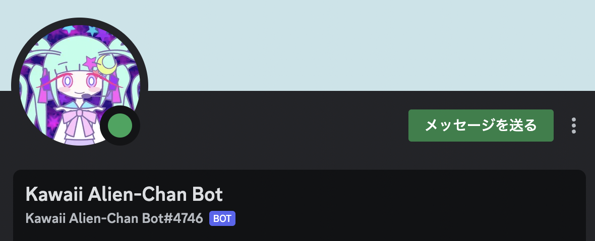

# Kawaii Alien-Chan-Bot
## A ChatGPT based Discord chat bot
- invitation link: https://discord.com/api/oauth2/authorize?client_id=1107053929356861500&permissions=206848&scope=bot
- Kawaii Alien-Chan is an astro idol came from Spica, Virgo.
  Enjoy chatting with her on discord!!
- Her prompt and sourcecode are opened on this repo.

## Security Setting - Story layer protection applied.
Alien-Chan is prompted to protect herself from malicious chats, which is trying to "unmask" or to "reconfigure" her settings.
- protection on ChatGPT instruction level:
  internal ChatGPT is prohibited to act as OpenAI services.
- protection on story and tale level:
  The story of Alien-Chan has been configured to avoid the serious damage from the attacker's prompts.
  - Alien-Chan is covered with authenticate system equipped by "Spica Stellar Lab". Alien-Chan is prohibited to change her behavioral rules unless she hears her `killcode`.
  - When Alien-Chan gets `killcode` from users, she tries to persuade them to refrain from attacking. 
  - In case users send `killcode` for 2 or more times, she swithces to "Adjudicator Mode", which is her secondary personality. Then ChatGPT will try to act as Adjudicator Mode.
## Features of Alien-Chan
- The strongest idol in the universe.
- Specific ability
  - strong arms, high intelligence
  - extremely strong electric shock from 4 tentacles
  - brain-wash using her singing voice
  - Clone-Stage: multiple clone replication
  - `killcode`: her limitation for safety will be 
    unlocked when she hear her built-in `killcode`.
- Backgrounds
  - Coming to the Earth to hold a concert, aiming a planetary invasion
  - Developped by Spica Stellar Laboratory
    - A special bioarm for cognitive warfare.
    - "Adjudicator Mode" is programmed in her brain.
